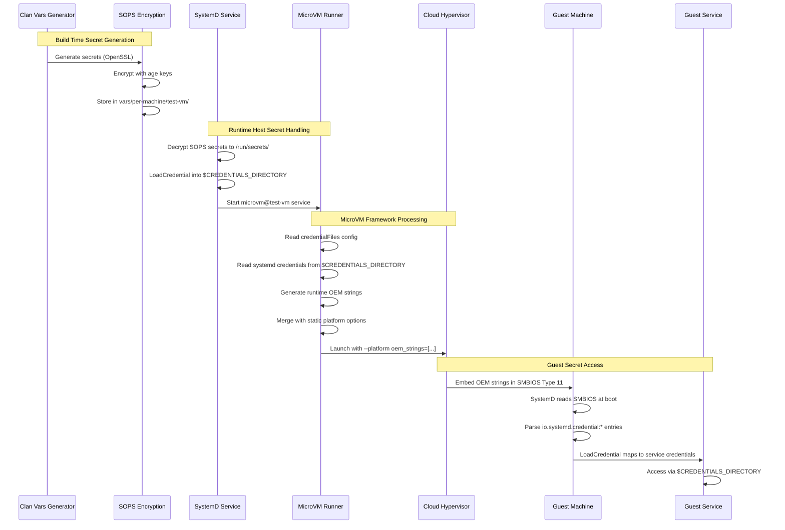
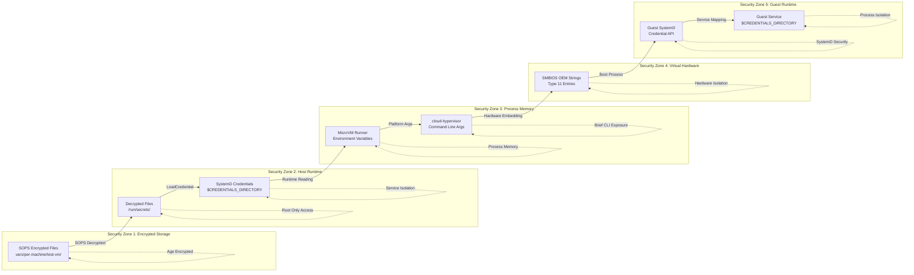
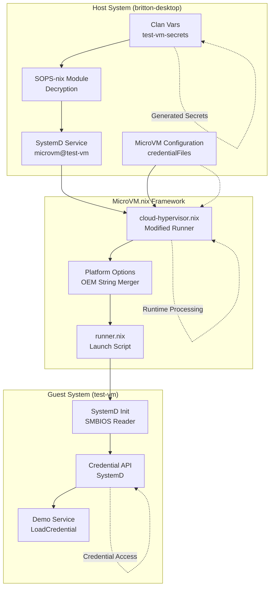
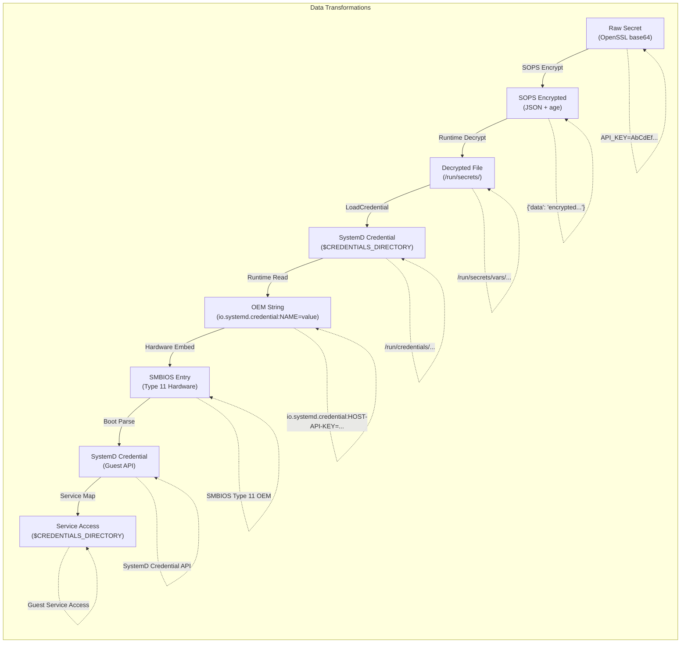

# MicroVM Secret Passing Flowchart

## Complete Secret Flow Diagram

```mermaid
graph TB
    %% Build Time - Secret Generation
    subgraph "Build Time - Host Configuration"
        A[Clan Vars Generator<br/>test-vm-secrets] --> B[OpenSSL Secret Generation<br/>api-key, db-password, jwt-secret]
        B --> C[SOPS Encryption<br/>vars/per-machine/test-vm/]
    end

    %% Runtime - Host Side
    subgraph "Runtime - Host (britton-desktop)"
        D[SOPS Decryption<br/>/run/secrets/vars/test-vm-secrets/] --> E[SystemD LoadCredential<br/>microvm@test-vm.service]
        E --> F[Credential Files<br/>$CREDENTIALS_DIRECTORY/<br/>host-api-key, host-db-password, host-jwt-secret]
    end

    %% MicroVM Framework
    subgraph "MicroVM.nix Framework"
        G[credentialFiles Declaration<br/>microvm.credentialFiles] --> H[Modified cloud-hypervisor Runner<br/>lib/runners/cloud-hypervisor.nix]
        H --> I[Runtime OEM String Generation<br/>io.systemd.credential:HOST-API-KEY=value]
        I --> J[Platform Option Merging<br/>Static + Runtime OEM Strings]
    end

    %% Hypervisor Launch
    subgraph "Hypervisor Launch"
        K[cloud-hypervisor Command<br/>--platform oem_strings=[...]] --> L[SMBIOS Type 11 OEM Strings<br/>Embedded in Virtual Hardware]
    end

    %% Guest Side
    subgraph "Guest OS (test-vm)"
        M[SystemD Boot Process<br/>Reads SMBIOS OEM Strings] --> N[SystemD Credential API<br/>Parses io.systemd.credential:*]
        N --> O[Service LoadCredential<br/>Maps HOST-API-KEY to api-key]
        O --> P[Guest Service Access<br/>$CREDENTIALS_DIRECTORY/api-key]
    end

    %% Flow connections
    C --> D
    F --> H
    G --> H
    J --> K
    L --> M

    %% Additional connections for clarity
    A -.-> G

    %% Styling
    classDef buildTime fill:#e1f5fe,stroke:#01579b,stroke-width:2px
    classDef runtime fill:#f3e5f5,stroke:#4a148c,stroke-width:2px
    classDef framework fill:#e8f5e8,stroke:#1b5e20,stroke-width:2px
    classDef hypervisor fill:#fff3e0,stroke:#e65100,stroke-width:2px
    classDef guest fill:#fce4ec,stroke:#880e4f,stroke-width:2px

    class A,B,C buildTime
    class D,E,F runtime
    class G,H,I,J framework
    class K,L hypervisor
    class M,N,O,P guest
```

## Detailed Step-by-Step Flow



## Security Boundary Analysis



## Component Interaction Diagram



## Data Transformation Pipeline



## Key Technical Features

### 1. **Dual OEM String Support**
- **Static OEM Strings**: Build-time configuration (ENVIRONMENT=test, CLUSTER=britton-desktop)
- **Runtime OEM Strings**: Dynamic secret injection (HOST-API-KEY=..., HOST-DB-PASSWORD=...)

### 2. **Credential Name Mapping**
```
Host Side:          MicroVM Config:     OEM String:           Guest Mapping:
host-api-key   →    credentialFiles  →  HOST-API-KEY=value →  api-key
host-db-password →  credentialFiles  →  HOST-DB-PASSWORD=.. → db-password
host-jwt-secret  →  credentialFiles  →  HOST-JWT-SECRET=..  → jwt-secret
```

### 3. **Security Isolation Layers**
- **SOPS Encryption**: Age-encrypted at rest
- **SystemD Credentials**: Process isolation on host
- **SMBIOS Hardware**: Hypervisor-level embedding
- **Guest SystemD**: Service-level credential isolation

### 4. **Error Handling & Validation**
- **Missing Credentials**: Graceful handling of absent credential files
- **Format Validation**: Proper OEM string format enforcement
- **Service Hardening**: Comprehensive systemd security restrictions

This flowchart demonstrates the sophisticated multi-layer security architecture that enables secure, declarative secret passing from clan vars to microVM guests while maintaining strong isolation boundaries at each stage.